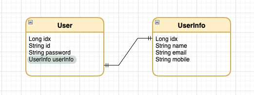
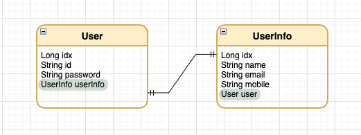
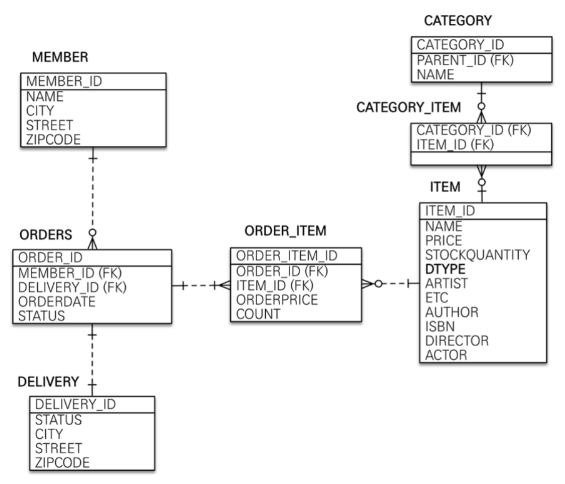
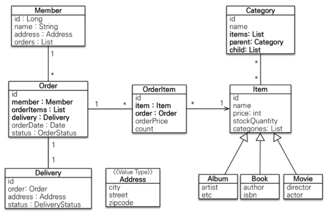

# 42.gg 3회차

**Jpa 연관관계 매핑**

- `@Embedded, @Embeddable`
    
    임베디드 타입은 복합 값 타임으로 불리며, 새로운 값 타입을 직접 정의해서 사용하는 JPA의 방법을 말함
    
    ```jsx
    @Entity
    public class User {
        @Id
        @GeneratedValue(strategy = GenerationType.IDENTITY)
        private Long id;
        private String name;
        private String email;
        private String city; // 도시
        private String district; // 구
        private String detail; // 상세주소
        private String zipCode; // 우편번호
    }
    
    @Entity
    public class User {
        @Id
        @GeneratedValue(strategy = GenerationType.IDENTITY)
        private Long id;
        private String name;
        private String email;
        @Embedded
        private Address address;
    }
    
    // Address.java
    @Embeddable
    @Data
    @AllArgsConstructor
    @NoArgsConstructor
    public class Address {
        private String city; // 도시
        private String district; // 구
    
        @Column(name = "address_detail")
        private String detail; // 상세 주소
        private String zipCode; // 우편번호
    }
    ```
    
    `user.setAddress(new Address("서울시", "강남구", "강남대로 123", "16427"));` 로 데이터를 추가 가능
    
    임베디드 타입을 null로 지정했을시 내부의 모든 column도 null인 것과 동일하다
    
    @Embeddable = 값 타입을 정의하는 곳
    
    @Embedded = 값 타임을 사용하는 곳
    
    임베디드 타입은 기본 생성자가 필수다.
    
- `@Inheritance`
    
    상속관계가 없는 관계형 데이터 베이스에 적용하려면 객체의 상속개념과 가장 유사한 슈퍼타입, 서브타입 관계라는 모델링 기법
    
    - JOINED
        
        엔티티 각각을 모두 테이블로 만들고, 자식 테이블이 부모 테이블의 기본키를 받아서 기본키 + 외래키로 사용하는 전략
        
        부모 테이블의 식별자(Discriminator)와 DTYPE을 두고 자식테이블을 따로 생성한다.
        
        타입을 구분하는 컬럼을 필수로 가지고 있어야 함
        
        - 사용 어노테이션
            - `@Inheritance(strategy = InheritanceType.JOINED)`
                - 부모 클래스에 지정. 조인 전략이므로 InheritanceType.JOINED 설정
            - `@DiscriminatorColumn(name = "DTYPE")`
                - 구분 컬럼 지정. Default값이 DTYPE이므로 name 속성은 생략 가능
            - `@DiscriminatorValue("TEST")`
                - 구분 컬럼에 입력할 값 지정. Default값으로 엔티티 이름 사용
            - `@PrimaryKeyJoinColumn(name = "Album_ID")`
                - Default로 자식 테이블은 부토 테이블 id 컬럼명을 그대로 사용하나, 변경시 해당 설정값 추가
        - 장점
            
            테이블의 정규화
            
            외래 키 참조 무결정 제약조건 활용 가능
            
            저장공간을 효율적으로 사용 가능
            
        - 단점
            
            잦은 join 사용으로 성능 저하
            
            복잡한 조회 쿼리
            
            데이터 등록시 insert 문 두번 사용
            
    - SINGLE_TABLE
        
        테이블 하나에 다 밀어넣기
        
        - 사용 어노테이션
            - @Inheritance(strategy = InheritanceType.SINGLE_TABLE)
            - @DiscriminatorColumn
            - @DiscriminaterValue
        - 장점
            
            조인이 사용되지 않아 조회 성능이 빠르다
            
            단순한 조회 쿼리문
            
        - 단점
            
            자식 엔티티가 매핑한 컬럼은 모두 NULL 허용
            
            높은 테이블이 커질 가능성으로 인해 오히려 조회 성능이 안좋아질 수 있다.
            
    - TABLE_PER_CLASS
        
        자시 엔티티마다 테이블을 만들고, 자식 테이블 각각에 필요한 컬럼을 모두
        
        - 사용 어노테이션
            - @Inheritance(strategy = InheritanceType.TABLE_PER_CLASS)
        - 장점
            
            서브 타입을 구분해서 처리할때 효과적이다.
            
            Not Null 제약조건 사용이 가능하다.
            
        - 단점
            
            여러 자식 테이블을 함께 조회할때 성능이 느리다. (SQL 에 UNION 을 사용해야 한다.
            
            자식 테이블을 통합해서 쿼리하기 어렵다.
            
- 영속성 컨텍스트
    
    Entity를 영구 저장하는 환경이라는 뜻
    
    어플리케이션이 DB에서 꺼내온 데이터 객체를 보관하는 가상의 DB같은 역할
    
    Entity Manager를 통해 엔티티를 조회하거나 저장할 때 엔티티를 보관 및 관리
    
    `entityManager.persist(entity);` 
    
    스프링에서는 EntityManager를 주입하여 사용하면 같은 트렌잭션(데이터베이스의 상태를 변환시키는 하나의 논리적 기능을 수행하는 작업의 단위)의 범위에 있는 EntityManager는 같은 영속성 컨텍스트에 접근한다.
    
- 연관관계 주인
    
    주인만이 데이터베이스 연관관계와 매핑된다.
    
    주인만이 외래키를 관리(등록, 수정, 삭제)할 수 있다.
    
    주인이 아닌쪽은 읽기만 할 수 있다
    
    주인이 아닌쪽은 순수한 객체에서만 관리되고, DB에 반영이 안된다.
    
    `@OneToMany(mappedBy = "team")` 
    
    항상 다(N)쪽이 외래 키를 가진다.
    
    @ManyToOne은 항상 연관관계의 주인이므로, mappedBy속성이 없다.
    
- `@ManyToOne, @OneToMany`
    
    @JoinColumn
    
    | name | 매핑할 외래 키의 이름을 지정할 때 사용
    기본 값 : 필드명 + _ + 참조하는 테이블의 컬럼명 (ex. post_postid) |
    | --- | --- |
    | referenceColumnName | 외래 키가 참조하는 대상 테이블의 컬럼명을 의미한다
    기본 값 : 테이블의 기본 키 컬럼명(ex. post_id) |
    | unique
    nullable
    insertable
    updatable
    columnDefinition
    table | @Column의 속성과 같다 |
    
    @ManyToOne의 속성 || OneToMany도 같으나, Optional 대신 mappedBy를 사용
    
    | Optional | optional=false로 설정하면 관계가 항상 존재해야 함을 의미
    optional=true는 연관된 엔티티가 없을 수도 있다는 것을 의미
    기본 값 : true |
    | --- | --- |
    | fetch | fetchType이 EAGER이면 연관된 엔티티를 바로 로딩한다
    fetchType이 LAZY이면 엔티티를 로딩하지 않고 실제로 해당 객체를 조회할떄 해당 엔티티를 로딩한다.
    기본값
    @ManyToOne=FetchType.EAGER
    @OneToMany=FetchType.LAZY |
    | cascade | 아래 표 참조 |
    
    | PERSIST | 부모 엔티티를 저장할 때 자식 엔터티도 같이 저장된다. |
    | --- | --- |
    | REMOVE | 부모 엔티티를 삭제하면 자식 엔터티도 같이 삭제된다. |
    | DETACH | 부모 엔티티가 detach 상태로 되면 자식 엔터티도 같이 detach 되어 변경사항이 반영되지 않는다. |
    | REFRESH | 부모 엔터티가 DB로부터 데이터를 다시 로드하면 자식 엔터티도 DB로부터 데이터를 다시 로딩한다 |
    | MERGE | 부모 엔티티가 detach 상태에서 자식 엔터티를 추가/변경한 이후에 부모 엔티티가 merge를 수행하면 자식 엔터티도 변경사항이 적용된다. |
    | ALL | 모두 cascade 옵이 전용된다. |

- `@OneToOne`
    - 장단점(외래키가 주 테이블에 있는 경우)
        - 주 객체가 대상 객체의 참조를 가지는 것처럼 주 테이블에 외래키를 두고 대상 테이블을 찾음
        - 객체지향 개발자가 선호하는 방법이다.
        - JPA 매핑이 편리하다.
        - 장점 : 주 테이블만 조회해도 대상 테이블에 데이터가 있는지 확인할 수 있다.
        - 단점 : 대상 테이블(Locker)이 비어있으면 외래 키에 null이 들어간다.
    - 단방향(외래키가 주 테이블에 있는 경우)
        - 예제 코드
            
            ```jsx
            @Table(name = "user")
            @Entity
            public class User {
            
                ...
            
                @OneToOne(fetch = FetchType.LAZY)
                @JoinColumn(name = "user_info_idx", referencedColumnName = "idx")
                private UserInfo userInfo;
            }
            ```
            
    
    
    
    - 양방향(외래키가 주 테이블에 있는 경우)
        - 예제 코드
            
            ```jsx
            @Table(name = "user")
            @Entity
            public class User {
            
                ...
            
                @OneToOne(fetch = FetchType.LAZY)
                @JoinColumn(name = "user_info_idx", referencedColumnName = "idx")
                private UserInfo userInfo;
            }
            
            @Table(name = "user_info")
            @Entity
            public class UserInfo {
            
                ...
                
                @OneToOne(mappedBy = "userInfo")
                private User user;
            }
            ```
            
    
    
    
    - 장단점(외래키가 대상 테이블에 있는 경우)
        - 대상 테이블에 외래키를 위치시킨다.
        - 데이터베이스 개발자가 선호하는 방법이다.
        - 장점 : 주 테이블과 대상 테이블을 일대일 관계에서 이후 일대다 관계로 변경할 때 용이하다.
        - 단점 : 프락시 기능의 한계로 지연 로딩으로 설정해도 항상 즉시 로딩되게 된다.
    - 양방향(외래키가 대상 테이블에 있는 경우)
        - 예제 코드
            
            ```jsx
            @Table(name = "user")
            @Entity
            public class User {
            
                ...
                
                @OneToOne(mappedBy = "user")
                private UserInfo userInfo;
            }
            
            @Table(name = "user_info")
            @Entity
            public class UserInfo {
            
                ...
                
                @OneToOne(fetch = FetchType.LAZY)
                @JoinColumn(name = "user_idx", referencedColumnName = "idx")
                private User user;
            }
            ```
            
    
    
    
    - N+1문제
        
        **@OneToOne FetchType.LAZY 적용이 안 되는 이슈**
        
        JPA 구현체인 Hibernate에서는 @OneToOne 양방향 매핑 시 지연 로딩으로 설정하여도 지연 로딩(LAZY)이 동작하지 않고, 즉시 로딩(EAGER)이 동작하는 이슈가 있는데요.
        
        **정확하게는 테이블을 조회할 때, 외래 키를 가지고 있는 테이블(연관 관계의 주인)에서는 외래 키를 가지지 않은 쪽에 대한 지연 로딩은 동작하지만, mappedBy 속성으로 연결된 외래 키를 가지지 않은 쪽에서 테이블을 조회할 경우 외래 키를 가지고 있는 테이블(연관 관계의 주인)에 대해서는 지연 로딩이 동작하지 않고 N+1 쿼리가 발생하게 되는 것입니다.**
        
        해당 이슈는 JPA의 구현체인 Hibernate에서 프록시 기능의 한계로 인해 발생하는데요.
        
        user 테이블이 외래 키인 user_info_idx를 가지고 있는 연관 관계의 주인이고, user_info 테이블은 외래 키가 없는 경우를 예시로 생각했을 때, user_info 테이블의 입장에서는 user 테이블에 대한 외래 키가 없기 때문에 UserInfo Entity 입장에서는 UserInfo에 연결되어 있는 user가 null인지 아닌지를 조회해보기 전까지는 알 수 없습니다.
        
        이처럼 UserInfo에 연결된 user 객체가 null 인지 여부를 알 수 없기 때문에 Proxy 객체를 만들 수 없는 것이며, 때문에 무조건 연결된 user가 있는지 여부를 확인하기 위한 쿼리가 실행되는 것입니다.
        
        *(UserInfo Entity를 조회했을 때 연결된 User Entity에 대해서 무조건 즉시 로딩이 적용되며, 따라서 N+1 조회가 발생하게 되는 것)*
        
- Entity

    

- Table

    

### EX01 Redis

redis 자료구조 공부 (string, hash, zset 등) → redis docs에 잘 나와있음 RedisTemplate 을 이용해서 redis hash, string, zset 자료구조에 접근하는 간단한 curd 로직 만들어보기 Redis 명령어를 redis-cli나 java spring에서 어떻게 쓰는지 바로 찾고 싶으면 chat gpt 이용해보기. 대부분의 상황에서는 잘 적용된다. 안되면 Redis 공식문서나 구글링하기.

- 참고자료
    - [우아한테크 세미나] 191121 우아한 레디스 by 강대명님
        - [[우아한테크세미나] 191121 우아한레디스 by 강대명님](https://youtu.be/mPB2CZiAkKM)
    - redis docs
        - [https://redis.io/docs/data-types/](https://redis.io/docs/data-types/)